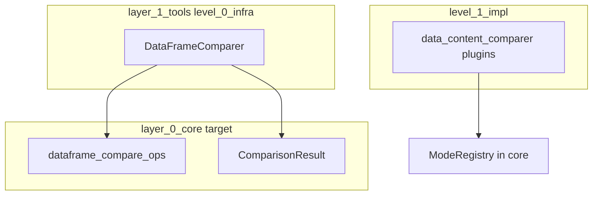

# ScriptCraft Layer Architecture (Phase 8 Canonical)

Single source of truth for implementation patterns, infrastructure surfaces, deprecated import ledger, and completion evidence for Phases 1–8.

**Remaining work:** [`ARCHITECTURE_backlog.md`](ARCHITECTURE_backlog.md)

**Former doc map:** `ARCHITECTURE_impl_patterns.md` → §2; `ARCHITECTURE_phase3_infra_candidates.md` → §5; `ARCHITECTURE_phase4_deprecated_aliases.md` → §4; `ARCHITECTURE_phase5_registry_cli.md` → §3; `ARCHITECTURE_phase6_core_candidates.md` → §6; `ARCHITECTURE_phase45_closeout_evidence.md` → §7.

---

## 0. Scope and roadmap position

| Phase | Status | Summary |
|-------|--------|---------|
| 1 — Impl internal cleanup | Closed | Hotspot dedupe; domain/orchestration/entrypoint splits |
| 2 — Impl normalization | Closed | Canonical tool layout documented |
| 3 — Infra preparation | Closed | Candidate inventory + gates |
| 4 — Infra cleanup | Closed | DAG fix, module splits, alias ledger |
| 5 — Infra normalization | Closed | Canonical dispatch/config/registry/CLI |
| 6 — Core migration prep | Closed | Ranked inventory + naming contract |
| 7 — Core P0 migration | Closed | C6-01/C6-02 promoted to core |
| **8 — Post-migration cleanup** | **Closed** | Facades removed, exports pruned, docs consolidated |

### Phase 8 code removals (2026-06-01)

| Removed surface | Canonical replacement |
|-----------------|----------------------|
| `level_1/git/probes.py` | `level_0/git_service.GitService` |
| `level_3/release_pipelines/factory.py` (`ReleasePipelineFactory`) | `level_4/generic_release_tool/pipelines.py` builders |
| `level_3/dataframe_comparer.py` (moved from level_2) | `level_3` barrel; core kernels via `layer_0_core.level_0` |
| `level_4/comparison_executor.py`, `level_4/compare.py` (moved from level_3) | `level_4` barrel |
| `create_tool_runner` export | `level_1.tool_dispatcher.dispatch_tool` |
| `compare_med_visit_ids` / default `med_ids` step | Removed placeholder; use explicit comparison steps |
| `level_Z/asset_updater/asset_reconciliation/` tree | `level_1_impl` L0/L1/L4 asset_reconciliation |

---

## 1. Layer dependency model

Placement follows numeric levels: a module's level is `1 + max(imported framework level)`. Do not import upward.

| Layer | Role |
|-------|------|
| `layer_0_core` | Stable platform primitives (validation kernels, registries, runtime) |
| `level_0_infra` | Reusable tool machinery (dispatch, config, pipelines, CLI) |
| `level_1_impl` | Tool orchestration and domain-specific behavior |
| `level_Z` | Optional typed plugins |

Related rules: `.cursor/rules/architecture.mdc`, `.cursor/rules/init-exports.mdc`, `.cursor/rules/impl-layer-patterns.mdc`. Open work: [`ARCHITECTURE_backlog.md`](ARCHITECTURE_backlog.md).

---

## 2. Implementation layer patterns (`level_1_impl`)

Canonical layout under `scriptcraft/layers/layer_1_tools/level_1_impl`.

### Tier roles

| Tier | Role | Typical contents |
|------|------|------------------|
| **L0** | Domain logic | Pure ops, registries, runners, step functions; no CLI |
| **L1** | Orchestration | `execute_*`, pipelines, mode bodies, I/O coordinators |
| **L2** | Wiring | Mode registry, builtin registration, thin mode entrypoints |
| **L3** | Tool | `BaseTool` subclass: validate → dispatch registry / lifecycle |
| **L4** | Entrypoint | `entrypoint.py` with `create_entrypoint_main(...)` or script-style CLI |
| **L6** | Exception | `release_manager` mode-first CLI only |
| **L_Z** | Plugins | Optional typed plugins (e.g. dictionary validators) |

### Registry ownership

1. **`ReleaseWorkflowRegistry`** — `release_manager` only (`level_0/release_manager/registry.py`). Builtin modes in `level_3/release_manager/plugins.py`.
2. **`ModeRegistry` / `MODE_REGISTRY`** — `data_content_comparer` (`level_2/data_content_comparer/plugins.py`).
3. **Infra `plugin_registry`** — dictionary validators; classes in `level_Z/dictionary_driven_checker_plugins`.

### CLI conventions

- **Default:** `level_4/<tool>/entrypoint.py` using `create_entrypoint_main` from `level_0_infra.level_7`.
- **`parser_kind`:** `standard`, `tool`, or `custom`.
- **`release_manager`:** mode-first argv via `parse_release_manager_argv`; CLI at `level_6/release_manager/cli.py`.

### Exemplar families

| Family | Tool | Entry | Notes |
|--------|------|-------|-------|
| release_manager | L4 `ReleaseManager` | L6 `cli.py` | Custom plugins: `level_4/release_manager/plugins/custom_*.py` |
| data_content_comparer | L3 `DataContentComparer` | L4 `entrypoint.py` | Dynamic `input_paths_required` for release modes |
| dictionary_driven_checker | L3 tool | L4 `entrypoint.py` | L_Z validator plugins |
| generic_release_tool | L0 tool | L1 `entrypoint.py` | Standalone repos; release CLIs at infra L5 |
| pypi_release_tool | L4 tool | L4 `entrypoint.py` | Workspace PyPI → `release_manager` `pypi` mode |
| asset_reconciliation | L0 `runner` | L1 `entrypoint.py` | Domain DAG on **infra** L0–L5 |
| asset_updater | L0 `runner` | L1 `entrypoint.py` | Browser/session automation on **infra** L0–L5 |

### When to use custom parsers

Use `extend_parser_func` / `run_kwargs_builder` when flags are not covered by `ParserFactory.create_standard_tool_parser`. Use dedicated `main()` only when the tool is not yet modeled as `BaseTool`.

### Legacy / deprecated

- `level_Z/asset_updater/asset_reconciliation/` — **removed in Phase 8**. Canonical: **infra** domain stack + **impl** L0 runner + L1 entrypoint per family.
- Do not add `release_manager_plugins` packages; use `level_0/release_manager` + `level_3/release_manager/plugins.py`.

### Phase 2 completion status

| Criterion | Status |
|-----------|--------|
| Canonical patterns documented | Done |
| Entrypoints use `create_entrypoint_main` where `BaseTool` applies | Done |
| No `release_manager_plugins` tree; no broken `level_7` imports | Done |
| `regenerate_package_inits --check` on `level_1_impl` | Done |
| Focused `layer_2_testing` architecture + tool tests | Done |

**Normalized families:** `release_manager`, `data_content_comparer`, `dictionary_driven_checker`, `generic_release_tool`, `pypi_release_tool`, `automated_labeler`, `date_format_standardizer`, `function_auditor`, `dictionary_cleaner`, `dictionary_workflow`, `schema_detector`, `asset_reconciliation`.

**Phase 2 follow-ups (not blocking):**

| Family | Current layout | Target |
|--------|----------------|--------|
| `dictionary_validator` | L3 tool + L2 entrypoint | Done in backlog closeout |
| `feature_change_checker` | L0 tool package | Done; legacy `*_main.py` removed |
| `scores_totals_checker` | L0 `score_totals_checker_main.py` | L4 entrypoint |
| `git_workspace_tool` | L0 tool + L1 entrypoint | Done in backlog closeout |
| `git_submodule_tool`, `rhq_form_autofiller` | Existing package-specific layout | Keep dependency-level placement; remove pointless shims |
| `medvisit_integrity_validator` | L1 tool + L2 entrypoint | Done in backlog closeout |
| `asset_updater` | L2 `main.py` | Keep direct L2 entrypoint wiring (L4 shim removed) |
| `function_auditor` tool | L0 (imports infra L4 → min L5) | Move to L5 when refactored |

**Import rules:** use level barrels; run `regenerate_package_inits` after moves; do not hand-edit `__init__.py`.

### Release manager custom plugins

Operational detail: `docs/release_manager/plugins/README.md`. Plugin path: `level_1_impl/level_4/release_manager/plugins/custom_<mode>.py`. Contract: `MODE`, `WORKFLOW`, optional `INFO`. Registration via `load_custom_plugins` from `level_0/release_manager/custom_plugin_loader.py`.

---

## 3. Infrastructure canonical surfaces (`level_0_infra`)

### Dispatch

| Concern | Canonical API | Import from |
|---------|---------------|-------------|
| Domain tool method routing (`check` → `run`) | `dispatch_tool(tool, domain, ...)` | `level_0_infra.level_1` |
| Tool lookup adapter | `InfraRegistryToolLookup`, `ToolLookup` | `level_0_infra.level_10.tool_lookup` |
| CLI execution by tool name | `dispatch_tool_by_name(tool_name, args, ...)` | `level_0_infra.level_11.tool_dispatch` |
| Global `scriptcraft` CLI entry | `main()` | `level_0_infra.level_12.cli` |

Do **not** import bare `dispatch_tool` from the root `level_0_infra` barrel when you mean CLI-by-name execution.

### Config

| Concern | Canonical API | Import from |
|---------|---------------|-------------|
| Typed config load | `load_config()` | `level_0_infra.level_5` |
| Config type | `Config` | `level_0_infra.level_2` |
| Standard tool runner | `run_tool()` | `level_0_infra.level_6` |

Removed in Phase 5: `level_1.config_loader`, `level_2.legacy_api.get_legacy_config`.

### Registry and discovery

| Concern | Canonical API | Import from |
|---------|---------------|-------------|
| Filesystem class discovery | `ToolDiscoveryEngine` | `level_0_infra.level_7` |
| Registry state / lifecycle | `UnifiedRegistry`, `unified_registry` | `level_0_infra.level_8` |
| Shared impl scan roots | `DEFAULT_TOOL_MODULE_PREFIX`, `default_tool_discovery_paths()` | `level_0_infra.level_0` (`impl_tool_roots`) |
| Discovery bootstrap | `ensure_tools_discovered()` | `level_0_infra.level_1` (`discovery_defaults`) |
| Programmatic list + descriptions | `ToolRegistry`, `registry.list_tools()` | `level_0_infra.level_9` |

`ToolLookup` is adapter-only (class resolution). Rich listing belongs on `ToolRegistry`.

### Per-tool vs global CLI

- **Per-tool entrypoints:** `create_entrypoint_main` from `level_0_infra.level_7`
- **Global `scriptcraft` CLI:** `level_0_infra.level_12.cli.main` (console script in `pyproject.toml`)

### Release pipelines (Phase 8)

Import pipeline builders from the **`level_4` barrel** (`create_python_package_pipeline`, `create_git_repo_pipeline`, `create_docs_pipeline`, `create_full_pipeline`). Canonical implementation: `level_4/generic_release_tool/pipelines.py`.

Do not use `ReleasePipelineFactory` (removed).

### Git operations (Phase 8)

Use `GitService` from `level_0/git_service.py`. Do not use `level_1/git/probes.py` (removed).

### Core validation kernels (Phase 8)

Import comparison primitives from core, not the tools `level_2` barrel:

```python
from scriptcraft.layers.layer_0_core.level_0.validation import (
    ComparisonResult,
    column_sets,
    content_differences,
    dtype_mismatches,
    index_sets,
    shape_mismatch,
)
```

Tools adapter `DataFrameComparer` remains at `level_3/dataframe_comparer.py`.

Comparison workflow executors (`comparison_executor.py`) and dataset wrapper (`compare.py` → `compare_datasets`) live at `level_4`; import via the `level_4` barrel.

---

## 4. Deprecated import ledger and migration status

### Config

| Deprecated | Canonical | Status |
|------------|-----------|--------|
| `level_1.config_loader.load_config()` | `level_5.config.load_config()` | **Removed** |
| `level_1.config_loader.get_config()` | `level_5.config.load_config()` | **Removed** |
| `level_2.legacy_api.get_legacy_config()` | `level_5.config.load_config()` | **Removed** |

### Dispatch

| Surface | Role | Status |
|---------|------|--------|
| `level_1.tool_dispatcher.dispatch_tool` | Domain tool method dispatch | **Canonical** |
| `level_11.tool_dispatch.dispatch_tool_by_name` | CLI tool execution | **Canonical** |
| `level_10.tool_lookup.InfraRegistryToolLookup` | Dispatch lookup adapter | **Canonical** |
| `level_2.processing.standardize_tool_execution` | `dispatch_tool` | **Removed** (Phase 5) |
| `level_2.processing.create_tool_runner` | `dispatch_tool` | **Removed** (Phase 8) |
| `level_2.comparison` facade | core validation or `dataframe_comparer` | **Removed** (Phase 6) |
| `level_2.pipeline_base` facade | `step_pipeline_engine` / `qc_pipeline_step` | **Removed** (Phase 6) |

### Pipeline engine names

| Deprecated | Canonical | Status |
|------------|-----------|--------|
| `BasePipeline` (tools infra) | `StepPipelineEngine` | **Removed** from `level_2` exports |
| `QCPipelineEngine` | `StepPipelineEngine` | **Removed** |
| `ReleasePipelineFactory` | `generic_release_tool.pipelines` builders | **Removed** (Phase 8) |

### Discovery

| Deprecated pattern | Canonical | Status |
|--------------------|-----------|--------|
| Hardcoded `level_1_impl` in `level_7.discovery` | `level_1.discovery_defaults` | **Canonical** |
| Hardcoded `level_1_impl` in `level_2.tool_metadata` | `level_0.impl_tool_roots` | **Canonical** |
| `level_9.discovery_defaults` | `level_1.discovery_defaults` | **Moved** |
| `level_4.runner.run_tool` | `level_6.runner.run_tool` | **Moved** |

### Registry (Phase 5)

| Deprecated / parallel | Canonical |
|-----------------------|-----------|
| `ToolLookup.list_tool_descriptions()` | `ToolRegistry.list_tools()` |
| Direct `unified_registry` run in CLI | `dispatch_tool_by_name` + `ToolRegistry` |

### Core relocation (Phase 7 — complete)

| Removed (tools shim) | Canonical (core) | Status |
|----------------------|------------------|--------|
| `level_2.dataframe_compare_ops` | `layer_0_core.level_0.validation.dataframe_compare_ops` | **Removed** — import core (C6-01) |
| `level_2.comparison_result` | `layer_0_core.level_0.validation.comparison_result` | **Removed** — import core (C6-02) |
| `level_2` barrel re-exports of core validation | `layer_0_core.level_0.validation` | **Removed** (Phase 8) |

---

## 5. Infra extraction candidates (Phase 3 backlog)

### Candidate 1: `release_manager/registry.py`

- **Ownership:** Stay in impl (release-domain specific).
- **Consumers:** `level_3/release_manager/plugins.py`, release manager tests.
- **Infra precondition:** Split generic named-workflow registry from release metadata filters.

### Candidate 2: `release_manager/custom_plugin_loader.py`

- **Ownership:** Infra candidate (Batch A).
- **Target contract:** `PluginWorkflowRegistryProtocol` + `load_plugins(registry, plugins_dir, pattern) -> int`.
- **Constraints:** No import-time side effects; per-file failure isolation.

### Candidate 3: `dictionary_driven_checker/runner.py`

- **Ownership:** Stay in impl (dictionary column conventions, domain output). Canonical path: `level_1_impl/level_1/dictionary_driven_checker/runner.py` (C6-D6).
- **Infra precondition:** Split generic row-validation loop from dictionary-domain mapping.

### Migration batches

1. **Batch A:** `custom_plugin_loader.py` interface prep and infra extraction boundary
2. **Batch B:** `release_manager/registry.py` split generic mechanics vs release metadata
3. **Batch C (defer):** `dictionary_driven_checker/runner.py` until semantic decoupling proven

### Infra promotion gates

All must be true: multi-consumer proof; no dependency inversion; no import-time side effects; no tool-domain terms in infra interface; runnable coverage in `layer_2_testing`.

### Review cycle log

- **Cycle 1 (2026-06-01):** Decisions recorded; order A → B → C.
- **Cycle 2 (2026-06-01):** No reclassification changes.

---

## 6. Core migration candidates (Phase 6/7 backlog)

### Migration gates (all required for promotion)

| Gate | Requirement |
|------|-------------|
| Multi-consumer | ≥2 independent consumers |
| Dependency purity | No `layer_1_tools` imports in promoted module |
| API neutrality | No tool-domain vocabulary in public names |
| Naming | No unresolved homonym with existing core symbol |
| Regression | Runnable tests listed per candidate |

### P0 — Phase 7-ready (promoted)

| ID | Canonical path | Status |
|----|----------------|--------|
| C6-01 | `layer_0_core/level_0/validation/dataframe_compare_ops.py` | **Promoted** |
| C6-02 | `layer_0_core/level_0/validation/comparison_result.py` | **Promoted** |

### P1 — Conditional (decouple then promote)

| ID | Current path | Blocker |
|----|--------------|---------|
| C6-03 | `level_1_impl/.../custom_plugin_loader.py` | Tools logging + release attr names |
| C6-04 | `level_1/comparison_errors.py` | Uses core `swallow_errors`; tools logging remains adapter concern |
| C6-05 | `level_0/path_resolver.py` ABC | `WorkspacePathResolver` is workspace-specific |
| C6-06 | `level_3/dataframe_comparer.py` | Hard-coded `WorkspaceConfig` id columns |

### P2 — Consolidate existing core

| ID | Symbol | Action |
|----|--------|--------|
| C6-07 | `NamedRegistry` | Document single import path |
| C6-08 | `ModeRegistry`, `execute_mode` | Already canonical in core |
| C6-09 | `get_typed_plugin` | Already canonical in core |

### Defer — not core candidates

| ID | Module / surface | Reason |
|----|------------------|--------|
| C6-D1 | `Config`, `PathConfig` | Workspace/study orchestration |
| C6-D2 | `StepPipelineEngine` | QC/workspace pipeline; homonym with `LifecyclePipelineBase` |
| C6-D3 | Registry/CLI stack | Tool discovery framework |
| C6-D4 | `dispatch_tool`, `tool_dispatcher` | Tool lifecycle vocabulary |
| C6-D5 | `ReleaseWorkflowRegistry` | Release metadata — impl-only |
| C6-D6 | `dictionary_driven_checker/runner.py` | Dictionary conventions — impl-only |

### Naming collision matrix

| Symbol | `layer_0_core` | `layer_1_tools` | Resolution |
|--------|----------------|-----------------|------------|
| **BasePipeline** | Alias → `LifecyclePipelineBase` | **Removed**; use `StepPipelineEngine` | **Never merge types.** Tools: `StepPipelineEngine`. Core: `LifecyclePipelineBase`. |
| **Config** | `BaseConfig` / domain configs | `Config` dataclass (`level_2/root_schema.py`) | No cross-layer short alias in shared barrels. |
| **PathConfig** | Training paths | Tool paths (`paths_schema.py`) | Keep separate; optional rename if unified. |
| **PipelineResult** | Core stage outcome | N/A | Unrelated to tools `ComparisonResult`. |

### Import-path rules

1. Use fully qualified imports for collision-prone symbols.
2. Do not reintroduce `level_2/comparison.py` or `level_2/pipeline_base.py` shims.
3. Core barrels must not re-export tools `Config`, `PathConfig`, or `StepPipelineEngine`.
4. Core validation kernels: import from `layer_0_core.level_0.validation`, not tools `level_2` barrel (Phase 8).

### Compatibility shims (sunset status)

| Candidate | Shim | Sunset |
|-----------|------|--------|
| C6-01/C6-02 | ~~`level_2` barrel re-exports~~ | **Removed** (Phase 8) |
| C6-03 | Keep impl path until infra extract | After 2 consumers use core loader |
| C6-04 | Tools wrapper + logger injection | After logging unified |
| C6-05 | ABC from core; workspace resolver in tools | When resolvers use core ABC |
| C6-06 | Injectable `id_columns` in tools only | N/A |

### Dependency graph (approved kernels)



**Rule:** `layer_0_core` must not import `layer_1_tools` (`test_core_does_not_import_tools_layers`).

---

## 7. Completion evidence and regression bundles

### Phase 4 exit criteria

| Criterion | Status | Evidence |
|-----------|--------|----------|
| `level_0/tool_lookup.py` DAG violation removed | Met | `test_tool_lookup_lives_at_level_10_not_level_0` |
| `comparison.py` / `pipeline_base.py` decomposed | Met | `test_phase4_splits.py`, `test_phase4_split_facades_removed` |
| Deprecated aliases tracked | Met | §4 above |
| Infra does not import `level_1_impl` | Met | `test_infra_does_not_import_level_1_impl` |
| Dispatch stack level ordering (9-12) | Met | `test_infra_dispatch_stack_respects_level_ordering` |
| Legacy upward imports allowlisted | Met | `test_infra_upward_imports_match_known_allowlist` |
| Split facades removed | Met | `test_phase6_level2_reexport_shims_removed` |

### Phase 5 exit criteria

| Criterion | Status | Evidence |
|-----------|--------|----------|
| Canonical dispatch/config/registry/CLI | Met | §3 above |
| Legacy config modules removed | Met | `test_phase5_legacy_config_modules_removed` |
| CLI uses `dispatch_tool_by_name` | Met | `test_phase5_cli_uses_canonical_dispatch` |
| Console entry `scriptcraft` | Met | `test_phase5_scriptcraft_console_entrypoint` |
| Registry/dispatch integration tests | Met | `test_phase5_registry_cli.py` |
| Root barrel narrowed (levels 10-12) | Met | `test_phase5_root_barrel_does_not_star_export_dispatch_levels` |
| No legacy infra import paths | Met | `test_no_legacy_infra_import_paths` |

### Waived / remediated preflight gaps (2026-06-01)

| Gap | Resolution |
|-----|------------|
| Leaf `__all__` in discovery/setup; pointless shims | Removed; canonical submodules |
| `standardize_tool_execution`, `BasePipeline`, `QCPipelineEngine` exports | Removed from `level_2` |
| Runtime logs under `data/logs/` | Added to package `.gitignore` |
| Missing `custom_plugin_loader.py` | Restored impl module per Phase 3 contract |

### Phase 6 exit criteria

| Criterion | Status | Evidence |
|-----------|--------|----------|
| Ranked core-candidate inventory | Met | §6 above |
| Migration gates automated | Met | `test_phase6_core_candidates.py` |
| Naming collision matrix | Met | §6 Naming collision matrix |
| P0 shortlist Phase 7-ready | Met | C6-01, C6-02 |
| No pointless level_2 re-export shims | Met | Shim modules removed |

### Phase 7 completion (P0 batch)

| Criterion | Status | Evidence |
|-----------|--------|----------|
| C6-01 canonical in core | Met | `layer_0_core/level_0/validation/dataframe_compare_ops.py` |
| C6-02 canonical in core | Met | `layer_0_core/level_0/validation/comparison_result.py` |
| No per-module tools shims | Met | Shim modules removed |
| Primary consumer uses core imports | Met | `dataframe_comparer.py` |
| Architecture gates | Met | `test_phase7_core_migration.py` |
| Parity tests | Met | `test_phase4_splits.py` (core paths) |

### Phase 8 exit criteria

| Criterion | Status | Evidence |
|-----------|--------|----------|
| Compatibility facades removed | Met | §0 Phase 8 code removals |
| Export surface pruned | Met | `level_2/__init__.py` no core re-exports; comparer at L3; executors at L4 |
| `med_ids` callers migrated | Met | `medvisit_integrity_validator` uses core `index_sets` |
| Root infra barrel narrowed | Met | `level_0_infra/__init__.py` excludes levels 10–12 |
| Architecture docs consolidated | Met | This document |
| Regression bundle passes | Met | Command below |

### Regression command bundle

From `implementations/python/python-package` with project venv:

```text
.\.venv\Scripts\python.exe -m pytest scriptcraft/layers/layer_2_testing/unit/test_architecture/test_layer_boundaries.py scriptcraft/layers/layer_2_testing/unit/test_infra/test_phase5_registry_cli.py scriptcraft/layers/layer_2_testing/unit/test_architecture/test_phase3_infra_candidates.py scriptcraft/layers/layer_2_testing/unit/test_architecture/test_phase6_core_candidates.py scriptcraft/layers/layer_2_testing/unit/test_architecture/test_phase7_core_migration.py scriptcraft/layers/layer_2_testing/unit/test_infra/test_phase4_splits.py scriptcraft/layers/layer_2_testing/unit/test_common/test_generic_release_pipelines.py scriptcraft/layers/layer_2_testing/unit/test_infra/test_file_plugin_loader.py scriptcraft/layers/layer_2_testing/unit/test_architecture/test_phase8_backlog_closure.py -q
```

### Architecture tests index

| Test module | Guards |
|-------------|--------|
| `test_layer_boundaries.py` | DAG, level ordering, legacy import paths |
| `test_phase3_infra_candidates.py` | Infra extraction gates |
| `test_phase4_splits.py` | Split modules + comparer integration |
| `test_phase5_registry_cli.py` | Dispatch/registry/CLI integration |
| `test_phase6_core_candidates.py` | Core migration inventory + doc presence |
| `test_phase7_core_migration.py` | C6-01/C6-02 promotion |

---

## 8. Review cycle log (chronological)

- **2026-06-01 Phase 3:** Infra candidate decisions; Batch A → B → C order.
- **2026-06-01 Phase 4/5:** Infra cleanup and normalization closed.
- **2026-06-01 Phase 6:** Broad-scope audit; P0 = C6-01/C6-02; naming contract approved.
- **2026-06-01 Phase 7:** C6-01/C6-02 promoted; tools shim modules removed; barrel re-exports added (later removed in Phase 8).
- **2026-06-01 Phase 8:** Facade removal, doc consolidation, export pruning.

---

## 9. Remaining work

All open items (Phase 2 follow-ups, Phase 3 extraction batches, Phase 7 core backlog, Phase 8 deferred cleanup) are tracked in **[`ARCHITECTURE_backlog.md`](ARCHITECTURE_backlog.md)**.

Do not duplicate backlog tables here; update the backlog doc when scheduling new work.
